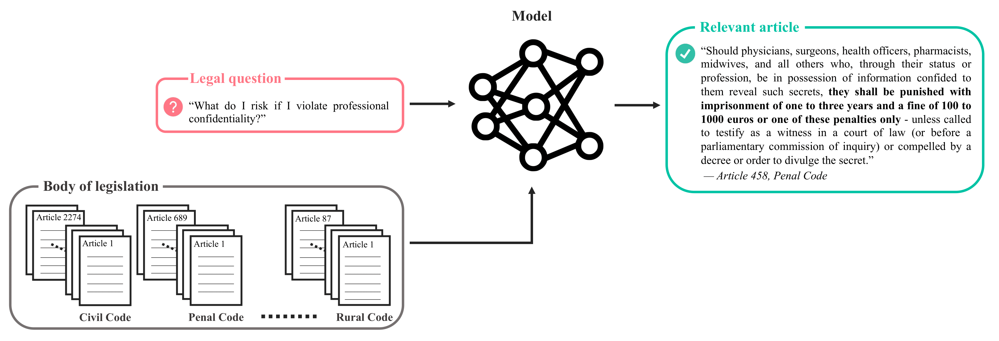

[](https://doi.org/10.5281/zenodo.5217310)

# A Statutory Article Retrieval Dataset in French

This repository contains the Belgian Statutory Article Retrieval Dataset (BSARD), as well as the code to reproduce the experimental results from the [associated paper](https://arxiv.org/abs/2108.) by [A. Louis](https://www.maastrichtuniversity.nl/p70072559), [G. Spanakis](https://www.maastrichtuniversity.nl/jerry.spanakis), and [G. Van Dijck](https://www.maastrichtuniversity.nl/gijs.vandijck).

**Abstract**. Statutory article retrieval is the task of automatically retrieving law articles relevant to a legal question. While recent advances in natural language processing have sparked considerable interest in many legal tasks, statutory article retrieval remains primarily untouched due to the scarcity of large-scale and high-quality annotated datasets. To address this bottleneck, we introduce the Belgian Statutory Article Retrieval Dataset (BSARD), which consists of 1,100+ French native legal questions labeled by experienced jurists with relevant articles from a corpus of 22,600+ Belgian law articles. Using BSARD, we benchmark several unsupervised information retrieval methods based on term weighting and pooled embeddings. Our best performing baseline achieves 50.8% R@100, which is promising for the feasibility of the task and indicates that there is still substantial room for improvement. By the specificity of the data domain and addressed task, BSARD presents a unique challenge problem for future research on legal information retrieval.



## Documentation

Detailed documentation on the dataset and how to reproduce the main experimental results can be found [here](docs/README.md).

## Citation

For attribution in academic contexts, please cite this work as:

```
@article{louis2021statutory,
  title = {A Statutory Article Retrieval Dataset in French},
  author = {Louis, Antoine and Spanakis, Gerasimos and Van Dijck, Gijs},
  journal = {arXiv preprint arXiv:2108.},
  year = {2021},
}
```

## License

This repository is licensed under the terms of the [CC BY-NC-SA 4.0](https://creativecommons.org/licenses/by-nc-sa/4.0/) license.
