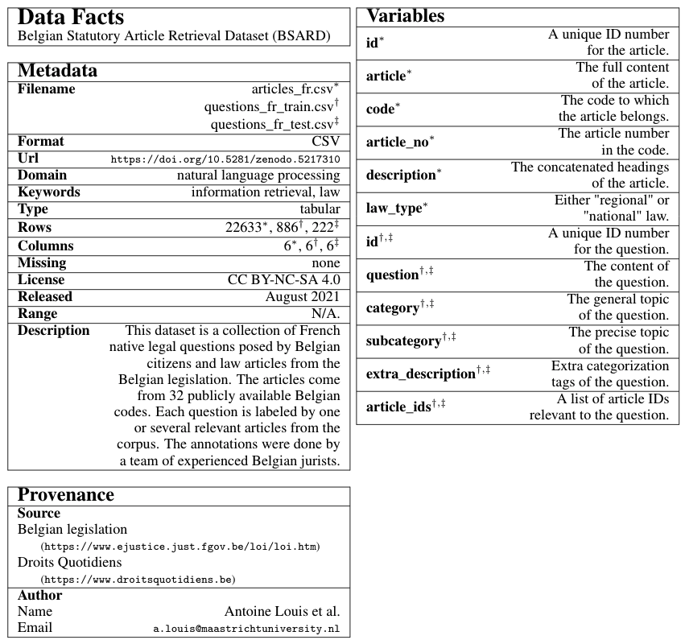
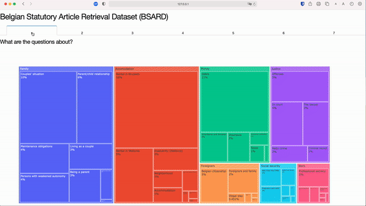

[](https://www.python.org/downloads/)

# A Statutory Article Retrieval Dataset in French

This repository contains:

* The Belgian Statutory Article Retrieval Dataset (BSARD)  v1.0.
* Web application to visualize insightful statistics about BSARD.
* Code for training and evaluating strong IR models on BSARD.

### Setup

This repository is tested on Python 3.8+. First, you should install a virtual environment:

```bash
python3 -m venv .venv/bsard
source .venv/bsard/bin/activate
```

Then, you can install all dependencies:

```bash
pip install -r requirements.txt
```

Additionally, you should install spaCy's [fr_core_news_md](https://spacy.io/models/fr#fr_core_news_md) pipeline (needed for text processing):

```bash
python3 -m spacy download fr_core_news_md
```

## BSARD: The Belgian Statutory Article Retrieval Dataset

### Access

We provide access to BSARD on [🤗 Datasets](https://huggingface.co/datasets/maastrichtlawtech/bsard). To load the dataset, you simply need to run:

```python
from datasets import load_dataset 
dataset = load_dataset("maastrichtlawtech/bsard") 
```

### Documentation

As a way to document our datatset, we provide the *dataset nutrition labels* [(Holland et al., 2018)](https://arxiv.org/abs/1805.03677).

<p align="center"></p>

### Visualization

We provide a [Dash](https://plotly.com/dash/) web application that shows insightful visualizations about BSARD.

<p align="center"></p>

To explore the visualizations on your local machine, run:

```bash
python scripts/eda/visualise.py
```

## Experiments

### Lexical Models

In order to evaluate the TF-IDF and BM25 models, run:

```bash
python scripts/experiments/run_zeroshot_evaluation.py \
    --articles_path </path/to/articles.csv> \
    --questions_path </path/to/questions_test.csv> \
    --retriever_model {tfidf, bm25} \ 
    --lem \ 
    --output_dir </path/to/output>
```

### Dense Models

#### Zero-Shot Evaluation

First, download the pre-trained French [fastText](https://fasttext.cc/docs/en/crawl-vectors.html#models) and [word2vec](https://fauconnier.github.io/#data) embeddings:

```bash
bash scripts/experiments/utils/download_embeddings.sh
```

Then, you can evaluate the bi-encoder models in a zero-shot setup:

```bash
python scripts/experiments/run_zeroshot_evaluation.py \
    --articles_path </path/to/articles.csv> \
    --questions_path </path/to/questions_test.csv> \
    --retriever_model {word2vec, fasttext, camembert} \ 
    --lem \                                           # [Only for word2vec and fastText] Lemmatize both articles and questions as pre-processing.
    --output_dir </path/to/output>
```

#### Training

In order to train a bi-encoder model, update the model and training hyperparameters in *scripts/experiments/train_biencoder.py*. Then, run:

```bash
python scripts/experiments/train_biencoder.py
```

To evaluate a trained bi-encoder model, update the checkpoint path in  *scripts/experiments/test_biencoder.py* and run:

```bash
python scripts/experiments/test_biencoder.py
```
